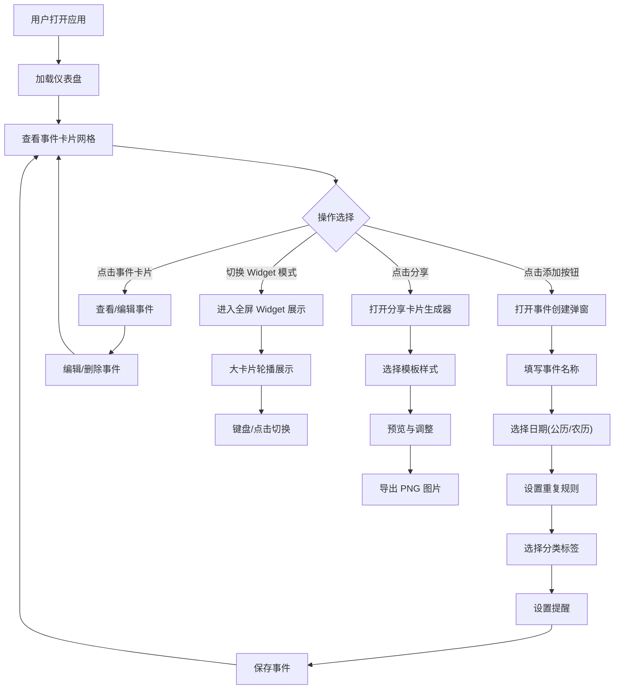

## 1. 产品概述

桌面倒数日与纪念日 Widget 管理器，对标「倒数日 Days Matter」/「Countdown」。帮助用户记录和追踪生活中所有重要时刻，通过精美的桌面浮层卡片直观展示事件倒计时/正计时，支持农历、重复事件、分类标签、通知提醒及分享卡片生成功能。

- 核心价值：让重要日期可视化，告别遗忘，赋予每一天仪式感
- 目标用户：学生、职场人士、注重生活仪式感的所有人群

## 2. 核心功能

### 2.1 功能模块

1. **仪表盘页面**：事件卡片网格展示、分类筛选、搜索、快速添加
2. **事件管理**：新建/编辑/删除事件、日期选择（公历/农历）、重复规则（每年/每月/每周/自定义）
3. **桌面 Widget 模式**：全屏浮层卡片展示、可拖拽排序、多种卡片样式切换
4. **分类标签系统**：预设分类（生日/纪念日/考试/旅行/发薪/Deadline）、自定义颜色标签
5. **通知提醒**：事件当天弹窗提醒、提前 N 天提醒、浏览器通知
6. **分享卡片生成**：多种精美模板、一键导出图片（PNG）

### 2.2 页面详情

| 页面名称 | 模块名称 | 功能描述 |
|---------|---------|----------|
| 仪表盘 | 顶部导航栏 | Logo、搜索框、视图切换（网格/Widget模式）、主题切换、添加按钮 |
| 仪表盘 | 分类筛选栏 | 预设分类标签（全部/生日/纪念日/考试/旅行/发薪/Deadline/自定义）、排序选项 |
| 仪表盘 | 事件卡片网格 | 浮动卡片展示倒计时/正计时、分类颜色边框、悬停动效、快捷操作 |
| 仪表盘 | 统计概览卡片 | 本月重要事件、即将到来事件、已过去纪念日统计 |
| 事件弹窗 | 表单区域 | 事件名称、图标选择、日期选择器（公历/农历切换）、时间设置 |
| 事件弹窗 | 重复设置 | 不重复/每年/每月/每周/自定义间隔、结束条件设置 |
| 事件弹窗 | 提醒设置 | 事件当天、提前1天/3天/7天/自定义天数提醒 |
| 事件弹窗 | 分类标签 | 预设分类选择、自定义颜色选择器 |
| Widget模式 | 全屏浮层 | 大尺寸卡片、背景模糊、左右滑动切换、键盘快捷键 |
| Widget模式 | 卡片样式 | 简约数字、倒计时圆环、情感化文案、多种预设主题 |
| 分享弹窗 | 模板选择 | 简约风/温馨风/节日风/商务风 多套卡片模板 |
| 分享弹窗 | 预览与导出 | 实时预览、尺寸选择、下载PNG按钮 |

## 3. 核心流程

用户打开应用 → 查看仪表盘上所有事件卡片 → 点击「+」添加新事件 → 填写事件名称、选择日期（支持农历）、设置重复规则 → 选择分类颜色标签 → 设置提醒 → 保存事件 → 事件出现在仪表盘 → 点击卡片查看详情/编辑 → 切换到 Widget 模式全屏展示 → 生成精美分享卡片导出

## 4. 用户界面设计

### 4.1 设计风格

- **整体美学方向**：「暖调新拟态 × 玻璃质感」。采用柔和渐变背景，结合 Glassmorphism 玻璃拟态卡片，营造温馨、精致、有温度的视觉感受。区别于传统工具类应用的冷硬风格。
- **主色调**：温暖珊瑚橘 `#FF6B6B` 作为主色，搭配玫瑰金渐变 `#FF6B6B → #FFA07A`，辅以奶油白 `#FFFBF5` 背景
- **辅助色**：分类颜色体系 - 生日粉 `#FF8FAB`、纪念日金 `#FFD93D`、考试蓝 `#6BCB77`、旅行青 `#4D96FF`、发薪绿 `#6BCB77`、Deadline 紫 `#9B59B6`
- **卡片样式**：圆角 24px，背景半透明 + backdrop-filter 模糊，柔和投影 `0 8px 32px rgba(0,0,0,0.08)`，悬停时微上浮 + 光晕扩散
- **字体方案**：标题使用「Outfit」几何无衬线字体，正文使用「Noto Sans SC」中文优化字体；超大倒计时数字使用等宽字体「JetBrains Mono」
- **图标风格**：统一采用 Duotone 双色图标，配合事件类别使用对应 Emoji 图标增强情感化
- **动效系统**：
  - 卡片入场：渐入 + 轻微上浮 + 交错延迟
  - 倒计时数字：翻牌滚动效果
  - 悬停反馈：Y 轴 -4px 位移 + 阴影加深 + 轻微光晕
  - 页面切换：磨砂过渡 + 共享元素动画

### 4.2 页面设计概览

| 页面名称 | 模块名称 | UI 元素与细节 |
|---------|---------|--------------|
| 仪表盘 | 顶部导航 | 玻璃拟态栏、Logo带渐变、搜索框带分类图标筛选、月亮/太阳主题切换、渐变悬浮「+」按钮 |
| 仪表盘 | 分类筛选 | 药丸形标签、选中态渐变填充 + 阴影、滚动滑动、未选中半透明描边 |
| 仪表盘 | 事件卡片 | 24px圆角、左上分类颜色条带、顶部Emoji大图标、超大倒计时数字(JetBrains Mono)、日期小字、底部三个快捷操作按钮(编辑/分享/置顶) |
| 仪表盘 | 统计卡 | 渐变背景圆环进度条、三栏统计(本月/即将到来/已过去)、趋势箭头指示 |
| 事件弹窗 | 整体 | 居中模态、背景全屏磨砂、宽680px、圆角32px、内边距40px |
| 事件弹窗 | 表单区 | 分段式输入、日期选择器双Tab切换(公历/农历)、农历带节气提示 |
| 事件弹窗 | 重复区 | 分段控件选择、自定义高级选项折叠面板 |
| 事件弹窗 | 提醒区 | 多选药丸标签、自定义天数输入、通知开关带动效 |
| Widget模式 | 全屏 | 背景高斯模糊原图、居中超级卡片(占屏60%)、左右淡入淡出切换、底部小圆点指示器、Esc退出提示 |
| 分享弹窗 | 模板区 | 4宫格缩略图预览、选中描边高亮、点击切换实时预览 |
| 分享弹窗 | 导出区 | 右侧大尺寸预览、尺寸选项(手机壁纸/社交分享/正方形)、渐变下载按钮 |

### 4.3 响应式设计

- **设计策略**：桌面优先 (Desktop-First)，向下适配平板和移动端
- **桌面端 (≥1440px)**：事件卡片 4 列网格、侧边统计面板常驻、Widget 模式卡片最大 800px
- **标准桌面 (1024-1439px)**：事件卡片 3 列网格、统计面板折叠为顶部条、Widget 卡片 600px
- **平板 (768-1023px)**：事件卡片 2 列网格、分类筛选横向滚动、弹窗自适应居中
- **移动端 (<768px)**：事件卡片单列、底部导航栏、Widget 模式全屏铺满、分享预览全屏
- **触控优化**：所有可点击区域最小 48×48px、滑动手势支持卡片切换、长按触发快捷菜单
