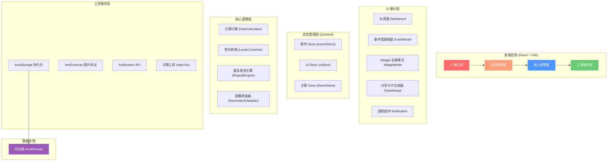

## 1. 架构设计



## 2. 技术描述

- **前端框架**：React@18 + TypeScript@5
- **构建工具**：Vite@5（高性能开发体验，HMR 极速热更新）
- **样式方案**：TailwindCSS@3 + CSS Variables（主题系统）+ Framer Motion（动画）
- **状态管理**：Zustand@4（轻量、简洁、支持持久化中间件）
- **日期处理**：date-fns@3（轻量日期库）+ 自定义农历转换算法
- **图片导出**：html2canvas@1（DOM 转 Canvas 转 PNG）
- **UI 组件库**：Headless UI（无样式基础组件）+ 自定义设计系统
- **图标方案**：Lucide React（现代化 SVG 图标库）
- **持久化方案**：localStorage + Zustand persist 中间件（无后端纯前端）
- **代码规范**：ESLint + Prettier

## 3. 路由定义（单页应用）

| 路由（Hash） | 页面/模式 | 说明 |
|-------------|----------|------|
| / | 仪表盘主页 | 默认入口，展示事件卡片网格、统计、筛选 |
| /widget | Widget 全屏模式 | 全屏浮层卡片轮播展示 |

## 4. 核心数据模型（TypeScript 类型定义）

```typescript
// 事件分类
type EventCategory = 'birthday' | 'anniversary' | 'exam' | 'travel' | 'salary' | 'deadline' | 'custom';

// 重复规则类型
type RepeatType = 'none' | 'yearly' | 'monthly' | 'weekly' | 'custom';

// 日期类型
type DateType = 'solar' | 'lunar';

// 提醒设置
interface ReminderSetting {
  onEventDay: boolean;        // 事件当天提醒
  daysBefore: number[];       // 提前 N 天提醒 [1, 3, 7, 30]
  customDays?: number;        // 自定义提前天数
  browserNotify: boolean;     // 浏览器通知
  popupNotify: boolean;       // 应用内弹窗提醒
}

// 分类配置
interface CategoryConfig {
  id: EventCategory | string;
  name: string;
  color: string;              // HEX 颜色值
  gradient: [string, string]; // 渐变色
  icon: string;               // Emoji 图标
}

// 事件核心数据结构
interface CountdownEvent {
  id: string;                     // UUID
  title: string;                  // 事件名称
  icon: string;                   // 事件图标（Emoji）
  categoryId: EventCategory | string;  // 分类ID
  
  dateType: DateType;             // 公历/农历
  targetDate: string;             // 公历日期 ISO: YYYY-MM-DD
  lunarDate?: {                   // 农历日期（可选）
    year: number;
    month: number;
    day: number;
    isLeapMonth?: boolean;
  };
  
  repeatType: RepeatType;         // 重复类型
  repeatCustomInterval?: number;  // 自定义重复间隔（天）
  repeatEndDate?: string;         // 重复结束日期
  
  reminder: ReminderSetting;      // 提醒设置
  isPinned: boolean;              // 是否置顶
  sortOrder: number;              // 排序权重
  
  createdAt: number;              // 创建时间戳
  updatedAt: number;              // 更新时间戳
  
  // 计算属性（运行时）
  nextOccurrence?: string;        // 下一次发生日期
  daysRemaining?: number;         // 剩余天数（正数=未来，负数=已过去）
  isPast?: boolean;               // 是否已过期
}

// 主题配置
type ThemeMode = 'light' | 'dark';

interface AppTheme {
  mode: ThemeMode;
  accentColor: string;
  cardStyle: 'minimal' | 'glass' | 'gradient';
}

// UI 全局状态
interface UIState {
  activeView: 'grid' | 'widget';
  activeCategoryId: string | 'all';
  sortBy: 'date' | 'created' | 'pinned';
  searchQuery: string;
  isEventModalOpen: boolean;
  editingEventId: string | null;
  isShareModalOpen: boolean;
  shareEventId: string | null;
  selectedShareTemplate: ShareTemplateId;
}
```

## 5. 目录结构设计

```
src/
├── components/           # 可复用 UI 组件
│   ├── layout/         # 布局组件
│   │   ├── Header.tsx          # 顶部导航栏
│   │   ├── CategoryFilter.tsx  # 分类筛选栏
│   │   └── StatsPanel.tsx      # 统计面板
│   ├── events/         # 事件相关组件
│   │   ├── EventCard.tsx       # 事件卡片
│   │   ├── EventGrid.tsx       # 事件网格容器
│   │   ├── EventModal.tsx      # 新建/编辑弹窗
│   │   └── DatePicker.tsx      # 公历/农历日期选择器
│   ├── widget/         # Widget 模式组件
│   │   ├── WidgetMode.tsx      # 全屏 Widget 容器
│   │   └── WidgetCard.tsx      # Widget 大卡片
│   ├── share/          # 分享卡片组件
│   │   ├── ShareModal.tsx      # 分享弹窗
│   │   ├── ShareCardPreview.tsx # 卡片预览
│   │   └── templates/          # 分享卡片模板
│   │       ├── MinimalTemplate.tsx
│   │       ├── WarmTemplate.tsx
│   │       ├── FestivalTemplate.tsx
│   │       └── BusinessTemplate.tsx
│   └── common/         # 通用基础组件
│       ├── Button.tsx
│       ├── Modal.tsx
│       ├── Input.tsx
│       ├── ColorPicker.tsx
│       ├── Toggle.tsx
│       └── NotificationToast.tsx
├── store/              # Zustand 状态管理
│   ├── eventsStore.ts         # 事件数据管理
│   ├── uiStore.ts             # UI 全局状态
│   └── themeStore.ts          # 主题状态
├── hooks/              # 自定义 React Hooks
│   ├── useCountdown.ts         # 倒计时计算 Hook
│   ├── useReminder.ts          # 提醒调度 Hook
│   ├── useLocalStorage.ts      # localStorage 封装
│   └── useKeyboardShortcuts.ts # 键盘快捷键
├── utils/              # 工具函数
│   ├── dateCalculator.ts       # 日期计算核心逻辑
│   ├── lunarConverter.ts       # 农历转换算法
│   ├── repeatEngine.ts         # 重复规则引擎
│   ├── shareImageExporter.ts   # 图片导出工具
│   ├── categoryPresets.ts      # 预设分类配置
│   └── uuid.ts                 # UUID 生成
├── types/              # TypeScript 类型定义
│   ├── event.ts
│   ├── category.ts
│   └── share.ts
├── styles/             # 全局样式
│   ├── globals.css             # 全局 Tailwind + 自定义样式
│   └── animations.css          # 关键帧动画定义
├── mock/               # 演示数据
│   └── sampleEvents.ts
├── App.tsx             # 根组件
├── main.tsx            # 入口文件
└── index.css           # Tailwind 入口
```

## 6. 关键算法说明

### 6.1 日期计算引擎（dateCalculator.ts）

```
核心输入：targetDate（目标日期） + repeatType（重复规则） + dateType（公历/农历）

输出：nextOccurrence（下次发生日期）、daysRemaining（剩余天数）

算法步骤：
1. 若 dateType = lunar → 通过 lunarConverter 转换为公历
2. 根据 repeatType 计算下次发生：
   - none: 直接使用原日期
   - yearly: 月份日期匹配，已过则 +1 年
   - monthly: 日期匹配，已过则 +1 月
   - weekly: 周几匹配，已过则 +1 周
   - custom: 每隔 N 天累加
3. nextOccurrence 与今天比较 → daysRemaining = 差值（天）
4. daysRemaining > 0 → 还剩；=0 → 今天；<0 → 已过去
```

### 6.2 农历转换算法（lunarConverter.ts）

- 采用基于农历数据表的转换方法，内置 1900-2100 年的农历数据
- 数据编码：每年一个整数表示闰月月份 + 各月大小 + 闰月大小
- 支持：公历 → 农历，农历 → 公历，判断闰月，节气日期近似计算

### 6.3 提醒调度（useReminder.ts + ReminderScheduler）

- 应用启动时扫描所有事件的 reminder 配置
- 计算今日需触发的提醒列表
- 使用 Notification API 请求浏览器权限
- 匹配当天/提前天数条件 → 弹出浏览器通知 + 应用内 Toast
- 已提醒事件记录标记（避免重复）

### 6.4 图片导出（shareImageExporter.ts）

- 将选中的分享模板组件渲染到隐藏 DOM
- 使用 html2canvas 截取为 Canvas
- Canvas.toDataURL('image/png') 转换为图片
- 生成 <a download> 触发下载

## 7. 初始演示数据（Mock Data）

首次打开自动注入 6-8 条示例事件：
1. 🎂 生日（每年重复）
2. 💕 恋爱纪念日（每年重复）
3. 🎓 期末考试（倒计时）
4. ✈️ 日本旅行（倒计时）
5. 💰 发薪日（每月重复）
6. ⏰ 项目 Deadline（一次性）
7. 🎄 圣诞节（每年）
8. 🏮 春节（农历，每年）
